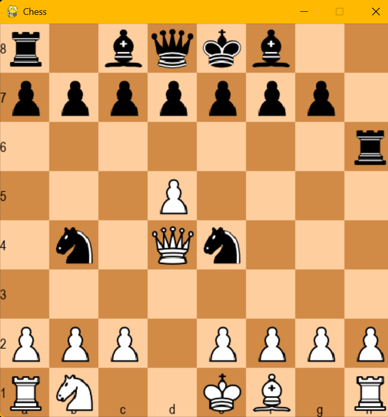
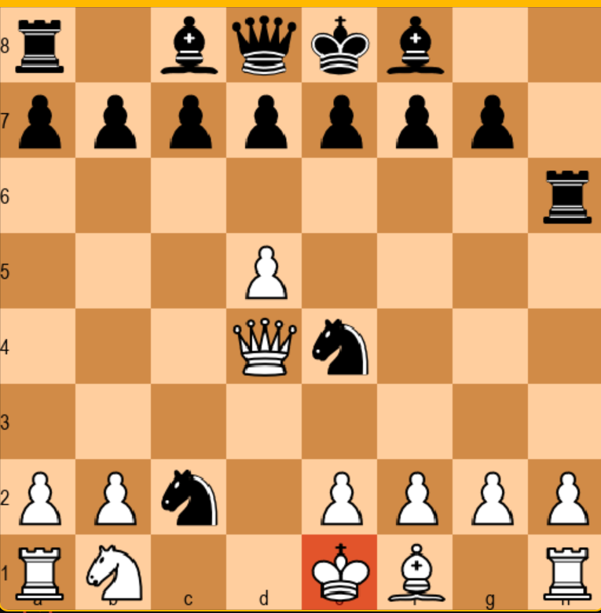
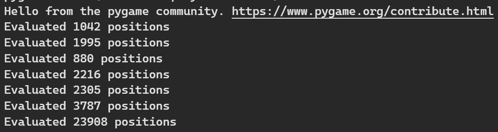

# Castled Realms: A Pygame Chess Engine with AI

Castled Realms is a classic game of chess built with Python and Pygame, featuring a challenging AI opponent. The AI is powered by the NegaMax algorithm with alpha-beta pruning, making for a formidable adversary.

## Features

-   **Classic Chess Gameplay**: Enjoy a game of chess with all the standard rules.
-   **Smart AI Opponent**: Test your skills against an AI that uses the NegaMax algorithm with alpha-beta pruning to find the best move.
-   **Advanced Chess Mechanics**: The game supports en passant, castling, and pawn promotion. Pawns are auto-promoted to a Queen.
-   **Move Animation**: Smooth animations for piece movements, including castling.
-   **Undo Moves**: Take back your last move with the 'z' key.
-   **Game Reset**: Start a new game by pressing the 'r' key when the game is over.

## Getting Started

### Prerequisites

-   Python 3.11
-   Pygame
-   pygbag

### Installation and Running the Game

1.  **Clone the repository:**
    ```bash
    git clone [https://github.com/dakshgoel2008/castled_realms.git](https://github.com/dakshgoel2008/castled_realms.git)
    cd castled_realms/Castled_Realms-c0ef02e72fed7eec6e0d619d0c4877f25a9790ca
    ```
2.  **Install dependencies:**
    ```bash
    pip install -r requirement.txt
    ```
3.  **Run the game:**
    ```bash
    python Chess/main.py
    ```

## Project Structure

The project is organized into the following files and directories:

-   `Chess/main.py`: The main entry point for the game. It contains the game loop and handles user input.
-   `Chess/engine.py`: Contains the `State` class, which manages the game's state, including the board, move log, and castling rights. It also includes the `Move` class for representing moves.
-   `Chess/smartMoveFinder.py`: Implements the AI's move-finding logic using the NegaMax algorithm with alpha-beta pruning.
-   `Chess/ui.py`: Handles the user interface, including drawing the board, pieces, and animations.
-   `Chess/config.py`: Contains configuration variables for the game, such as screen dimensions and AI depth.
-   `Chess/images/`: Contains the images for the chess pieces.
-   `.github/workflows/deploy.yml`: GitHub Actions workflow for building and deploying the game to GitHub Pages.

## The AI Opponent

The AI opponent uses a sophisticated algorithm to determine its moves:

-   **NegaMax with Alpha-Beta Pruning**: The core of the AI is the NegaMax algorithm, which is a variant of MiniMax. It's enhanced with alpha-beta pruning to reduce the number of nodes evaluated in the search tree.
-   **Transposition Table**: A transposition table is used to store previously evaluated board positions, which helps to speed up the search by avoiding redundant calculations.
-   **Move Ordering**: Moves are ordered to improve the efficiency of alpha-beta pruning. Captures are prioritized using the Most Valuable Victim - Least Valuable Attacker (MVV-LVA) heuristic.
-   **Board Evaluation**: The AI evaluates board positions based on several factors:
    -   **Material**: The value of the pieces on the board.
    -   **Positional Advantage**: Piece-square tables are used to give pieces a bonus for being on strategically advantageous squares.
    -   **King Safety**: The AI considers the safety of the kings.
    -   **Pawn Structure**: The structure of the pawns is evaluated.
    -   **Mobility**: The number of available moves for the pieces is taken into account.

## Future Improvements

-   **Enhanced AI**: I am exploring advanced search techniques and looking forward for the integration of Neural Networks to make the AI even smarter and faster.
-   **Improved Mobility Evaluation**: Looking forward to improve the mobility evaluation for all the pieces.

## Sample Screenshots
- ###  Scnerio given to AI


- ###  AI Output


- ### Total move calculated
 
